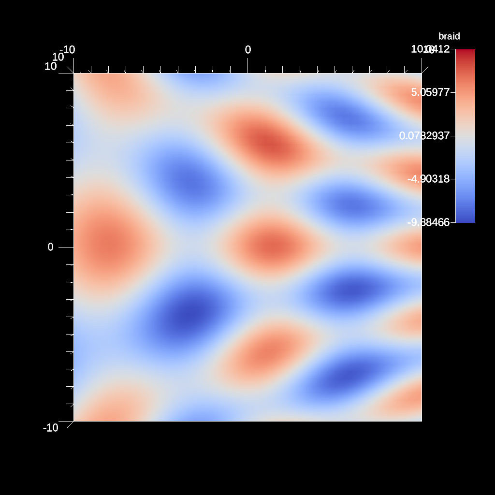

# First Light Example

- https://ascent.readthedocs.io/en/latest/Tutorial_Intro_First_Light.html

The `First Light` example demonstrates a basic visualization pipeline to
generate an image with Ascent: create data → publish → define actions → execute
→ close.

Here, the example dataset is an unstructured mesh composed of hexagons:

- https://llnl-conduit.readthedocs.io/en/latest/blueprint_mesh.html#braid

### ascent_first_light_example.cpp

The [ascent_first_light_example.cpp][cpp] example code renders the example
dataset using ray casting to create a pseudocolor plot.

[cpp]: https://github.com/Alpine-DAV/ascent/blob/develop/src/examples/tutorial/ascent_intro/cpp/ascent_first_light_example.cpp

```cpp
    Node mesh;
    conduit::blueprint::mesh::examples::braid("hexs", 50, 50, 50, mesh);
    // Creates a 3D mesh using Conduit Blueprint\'s braid example
    // a 50×50×50 hex mesh stored in a conduit::Node named mesh

    Ascent a; // create an Ascent instance
    a.open(); // open ascent
    a.publish(mesh); // publish mesh data to ascent

    Node actions; // create a Conduit node of actions
    Node &add_act = actions.append();
    add_act["action"] = "add_scenes";
    Node &scenes = add_act["scenes"];
    scenes["s1/plots/p1/type"] = "pseudocolor"; // add pseudocolor plot p1 to scene s1
    scenes["s1/plots/p1/field"] = "braid"; // plot the field braid 
    scenes["s1/image_name"] = "out_first_light_render_3d";
    // sets the output basename (.png rendering)

    a.execute(actions); // execute the actions
    a.close(); // close ascent
```

### ascent_actions.yaml

```yaml
-
  action: "add_scenes"
  scenes:
    s1:
      plots:
        p1:
          type: "pseudocolor"
          field: "braid"
      image_name: "out_first_light_render_3d"
```

### out_first_light_render_3d.png



### Build and run on Alps

```sh
uenv image pull build::insitu_ascent/0.9.5:2109123735@daint
uenv start -v default insitu_ascent/0.9.5:2109123735

cp -a /user-tools/linux-neoverse_v2/ascent-0.9.5-*/examples/ascent/tutorial/ascent_intro/cpp .
cd cpp

make ASCENT_DIR=/user-tools/env/default/ ascent_first_light_example

L1=/user-tools/linux-neoverse_v2/cray-gtl-8.1.32-25u7zwci35lms4zyrodhf24vlfken7xo/lib

LD_LIBRARY_PATH=$L1:$LD_LIBRARY_PATH ./ascent_first_light_example
```
