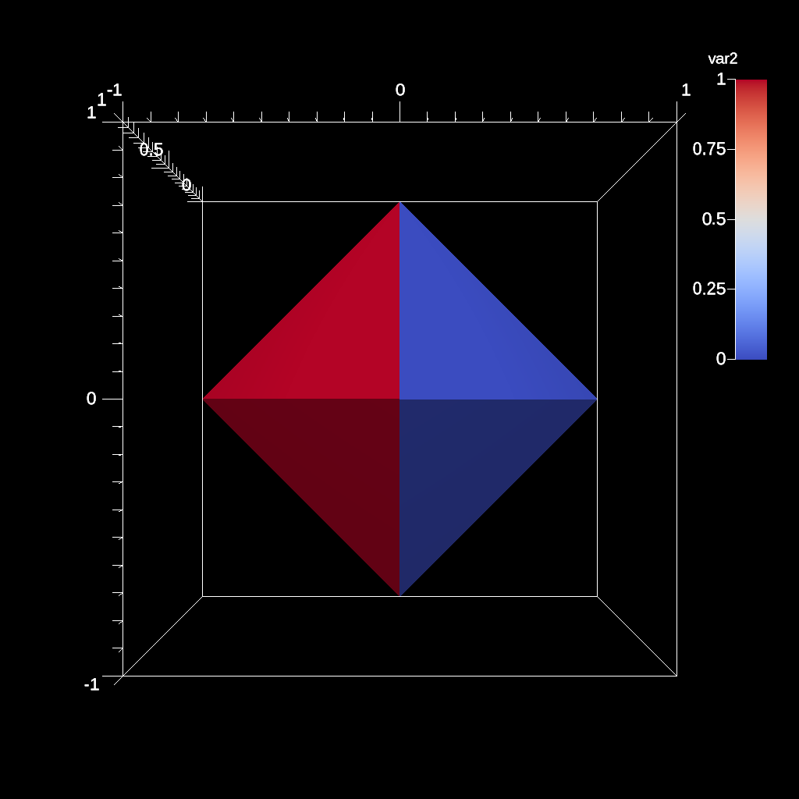
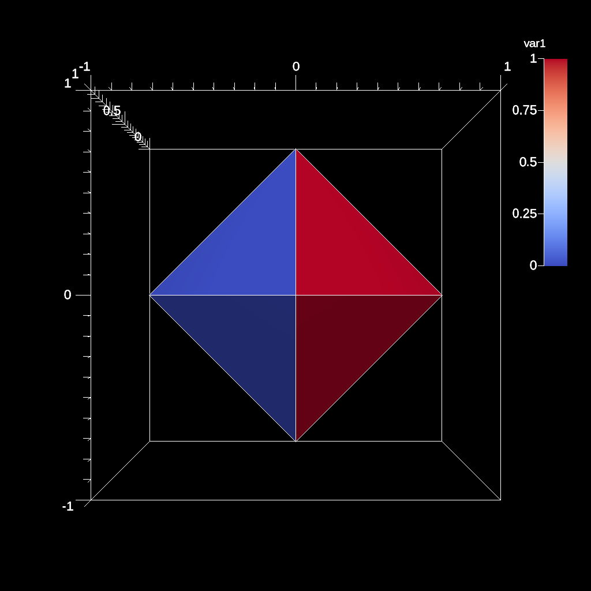
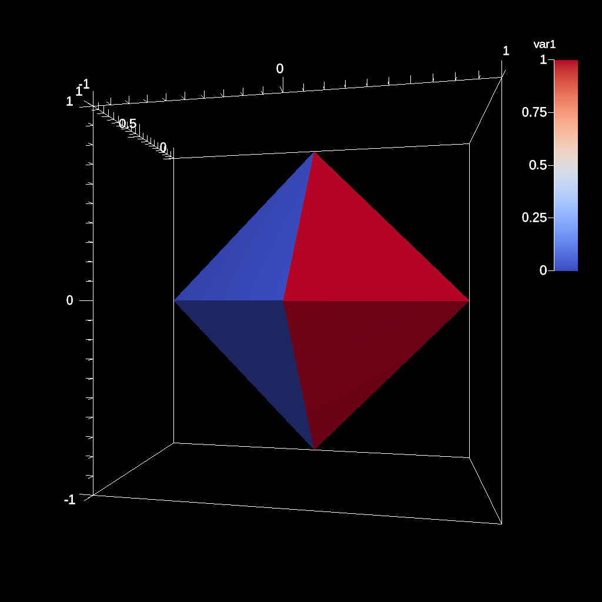
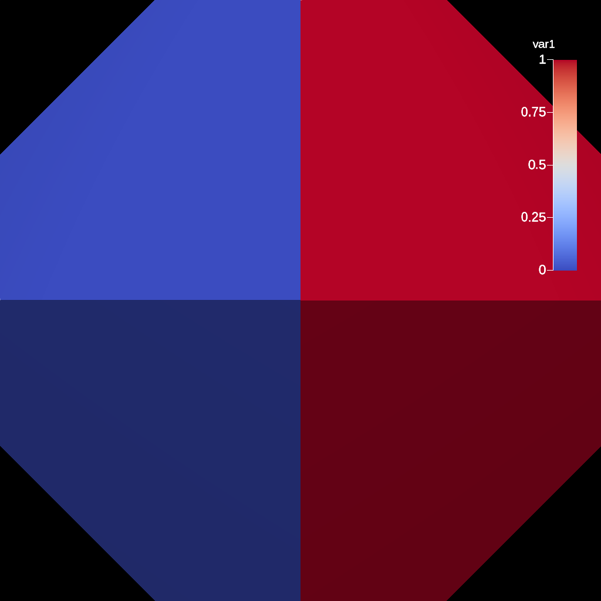
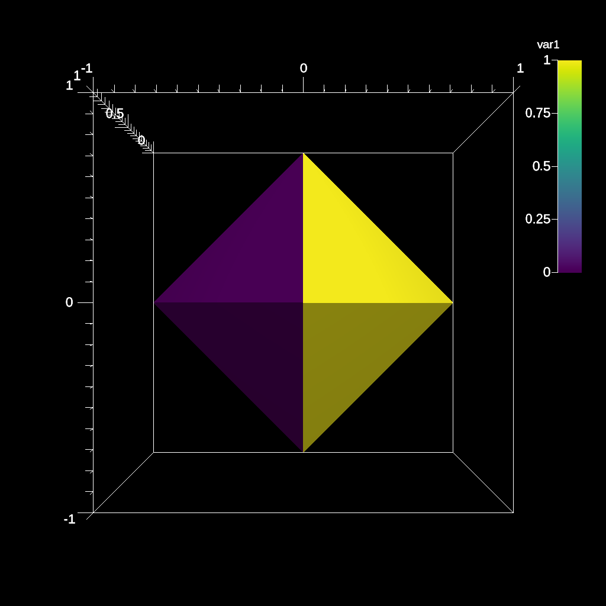
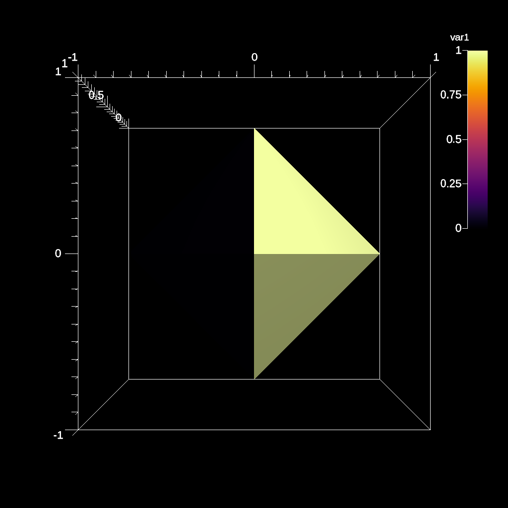

# Ascent scene Example

- https://ascent.readthedocs.io/en/latest/Tutorial_Intro_Scenes.html

## Rendering images with Scenes

Scenes are the construct used to render pictures of meshes in Ascent. A scene
description encapsulates all the information required to generate one or more
images. Scenes can render mesh data published to Ascent or the result of an
Ascent Pipeline. This section of the tutorial provides a few simple examples
demonstrating how to describe and render scenes.

### ascent_scene_example1.cpp

The [ascent_scene_example1.cpp][cpp] example code renders the example
dataset using ray casting to create a pseudocolor plot.

[cpp]: https://github.com/Alpine-DAV/ascent/blob/develop/src/examples/tutorial/ascent_intro/cpp/ascent_scene_example1.cpp

```cpp
    Node mesh;
    tutorial_tets_example(mesh);

    Ascent a; // create an Ascent instance
    a.open(); // open ascent
    a.publish(mesh); // publish mesh data to ascent

    Node actions; // create a Conduit node of actions
    Node &add_act = actions.append();
    add_act["action"] = "add_scenes";
    Node &scenes = add_act["scenes"];

    // render the field 'var1' in scene 's1'
    scenes["s1/plots/p1/type"] = "pseudocolor";
    scenes["s1/plots/p1/field"] = "var1";
    scenes["s1/image_prefix"] = "ascent_output_render_var1";
    // sets the output basename (.png rendering)

    // render the field 'var2' in scene 's2'
    scenes["s2/plots/p1/type"] = "pseudocolor";
    scenes["s2/plots/p1/field"] = "var2";
    scenes["s2/image_prefix"] = "ascent_output_render_var2";
    // sets the output basename (.png rendering)

    a.execute(actions); // execute the actions
    a.close(); // close ascent
```

### ascent_actions.yaml

```yaml
-
  action: "add_scenes"
  scenes:
    s1:
      plots:
        p1:
          type: "pseudocolor"
          field: "var1"
      image_prefix: "ascent_output_render_var1"
    s2:
      plots:
        p1:
          type: "pseudocolor"
          field: "var2"
      image_prefix: "ascent_output_render_var2"
```      

### ascent_scene_example1

- ascent_scene_example1: ascent_output_render_var1_000000.png


- ascent_scene_example1: ascent_output_render_var2_000000.png



### Build and run on Alps

```sh
uenv image pull build::insitu_ascent/0.9.5:2109123735@daint
uenv start -v default insitu_ascent/0.9.5:2109123735

cp -a /user-tools/linux-neoverse_v2/ascent-0.9.5-*/examples/ascent/tutorial/ascent_intro/cpp .
cd cpp

make ASCENT_DIR=/user-tools/env/default/ ascent_scene_example1

L1=/user-tools/linux-neoverse_v2/cray-gtl-8.1.32-25u7zwci35lms4zyrodhf24vlfken7xo/lib

LD_LIBRARY_PATH=$L1:$LD_LIBRARY_PATH ./ascent_scene_example1
```

### ascent_scene_example2

Rendering multiple plots to a single image: https://github.com/Alpine-DAV/ascent/blob/develop/src/examples/tutorial/ascent_intro/cpp/ascent_scene_example2.cpp

```yaml
-
  action: "add_scenes"
  scenes:
    s1:
      plots:
        p1:
          type: "pseudocolor"
          field: "var1"
        p2:
          type: "mesh"
      image_prefix: "out_scene_ex2_render_two_plots"
```      



### ascent_scene_example3

Adjusting camera parameters: https://github.com/Alpine-DAV/ascent/blob/develop/src/examples/tutorial/ascent_intro/cpp/ascent_scene_example3.cpp

```yaml
-
  action: "add_scenes"
  scenes:
    s1:
      plots:
        p1:
          type: "pseudocolor"
          field: "var1"
      renders:
        r1:
          image_name: "out_scene_ex3_view1"
          camera:
            azimuth: 10.0
        r2:
          image_name: "out_scene_ex3_view2"
          camera:
            zoom: 3.0
```      

- ascent_scene_example3: out_scene_ex3_view1.png



- ascent_scene_example3: out_scene_ex3_view2.png




- See the Renders docs for more details: https://ascent.readthedocs.io/en/latest/Actions/Scenes.html#renders-optional

### ascent_scene_example4

Changing color tables: https://github.com/Alpine-DAV/ascent/blob/develop/src/examples/tutorial/ascent_intro/cpp/ascent_scene_example4.cpp

```yaml
-
  action: "add_scenes"
  scenes:
    s1:
      plots:
        p1:
          type: "pseudocolor"
          field: "var1"
          color_table:
            name: "Viridis"
      image_name: "out_scene_ex4_render_viridis"
    s2:
      plots:
        p1:
          type: "pseudocolor"
          field: "var1"
          color_table:
            name: "Inferno"
      image_name: "out_scene_ex4_render_inferno"
```      

- ascent_scene_example4: out_scene_ex4_render_viridis.png



- ascent_scene_example4: out_scene_ex4_render_inferno.png



- See the Color Tables docs for more details: https://ascent.readthedocs.io/en/latest/Actions/Scenes.html#color-tables
