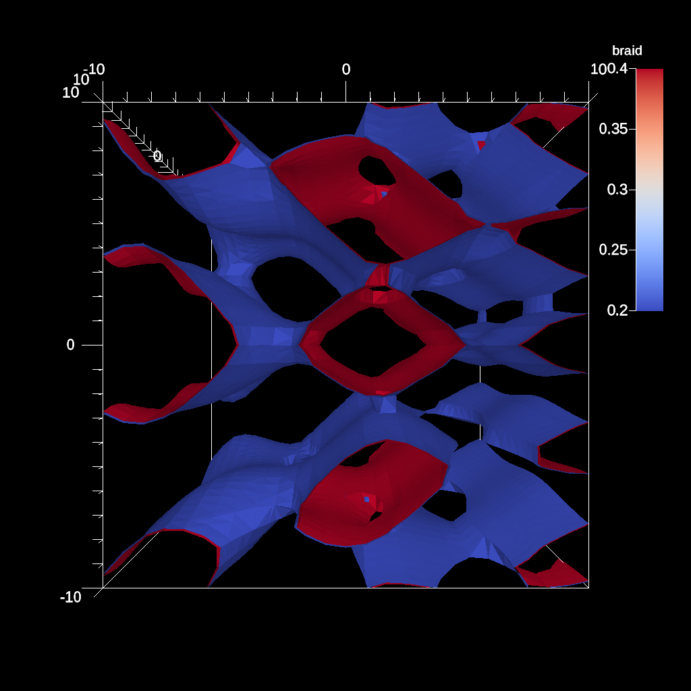

# Ascent pipeline Example

- https://ascent.readthedocs.io/en/latest/Tutorial_Intro_Pipelines.html

## Transforming data with Pipelines

Pipelines are the construct used to compose filters that transform the
published input data into new meshes. This is where users specify typical
geometric transforms (e.g., clipping and slicing), field based transforms
(e.g., threshold and contour), etc. The resulting data from each Pipeline can
be used as input to Scenes or Extracts. Each pipeline contains one or more
filters that transform the published mesh data. See Ascent’s Scenes docs for
deeper details on Pipelines.

### ascent_pipeline_example1.cpp

The [ascent_pipeline_example1.cpp][cpp1] example code is a minimal example of
creating data, defining a processing pipeline, and rendering with Ascent. The
result is the contour rendering of the "braid" field for 2 iso-values (0.2 and
0.4). 

[cpp1]: https://github.com/Alpine-DAV/ascent/blob/develop/src/examples/tutorial/ascent_intro/cpp/ascent_pipeline_example1.cpp

```cpp
    Node mesh;
    conduit::blueprint::mesh::examples::braid("hexs", 25, 25, 25, mesh);
    // Creates a 3D mesh using Conduit Blueprint\'s braid example
    // a 25×25×25 hex mesh stored in a conduit::Node named mesh

    Ascent a; // create an Ascent instance
    a.open(); // open ascent
    a.publish(mesh); // publish mesh data to ascent

    Node actions; // create a Conduit node of actions
    Node &add_act = actions.append();

    add_act["action"] = "add_pipelines";
    Node &pipelines = add_act["pipelines"];  
    pipelines["pl1/f1/type"] = "contour";
    // create a pipeline (pl1) with a contour filter (f1):
    Node &contour_params = pipelines["pl1/f1/params"];
    // extract contours where braid variable equals 0.2 and 0.4:
    contour_params["field"] = "braid";
    double iso_vals[2] = {0.2, 0.4};
    contour_params["iso_values"].set(iso_vals,2);

    // add scene to render the pipeline result:
    Node &add_act2 = actions.append();
    add_act2["action"] = "add_scenes";
    Node & scenes = add_act2["scenes"];

    // add a scene (s1) with one pseudocolor plot (p1) that
    // will render the result of pipeline (pl1)
    scenes["s1/plots/p1/type"] = "pseudocolor";
    scenes["s1/plots/p1/pipeline"] = "pl1";
    scenes["s1/plots/p1/field"] = "braid";

    // set the output basename (.png rendering)
    scenes["s1/image_name"] = "out_pipeline_ex1_contour";

    a.execute(actions); // execute the actions
    a.close(); // close ascent
```

### ascent_actions.yaml

```yaml
-
  action: "add_pipelines"
  pipelines:
    pl1:
      f1:
        type: "contour"
        params:
          field: "braid"
          iso_values: [0.2, 0.4]
-
  action: "add_scenes"
  scenes:
    s1:
      plots:
        p1:
          type: "pseudocolor"
          pipeline: "pl1"
          field: "braid"
      image_name: "out_pipeline_ex1_contour"
```      

### ascent_pipeline_example1.cpp -> .png
out_pipeline_ex1_contour.png

- ascent_pipeline_example1: out_pipeline_ex1_contour.png



### Build and run on Alps

```sh
uenv image pull build::insitu_ascent/0.9.5:2109123735@daint
uenv start -v default insitu_ascent/0.9.5:2109123735

cp -a /user-tools/linux-neoverse_v2/ascent-0.9.5-*/examples/ascent/tutorial/ascent_intro/cpp .

make ASCENT_DIR=/user-tools/env/default/ ascent_pipeline_example1

L1=/user-tools/linux-neoverse_v2/cray-gtl-8.1.32-25u7zwci35lms4zyrodhf24vlfken7xo/lib

LD_LIBRARY_PATH=$L1:$LD_LIBRARY_PATH ./ascent_pipeline_example1
```

### More examples

The [ascent_pipeline_example2.cpp][cpp2] and
[ascent_pipeline_example3.cpp][cpp3] examples are currently not working on Alps.

[cpp2]: https://github.com/Alpine-DAV/ascent/blob/develop/src/examples/tutorial/ascent_intro/cpp/ascent_pipeline_example2.cpp
[cpp3]: https://github.com/Alpine-DAV/ascent/blob/develop/src/examples/tutorial/ascent_intro/cpp/ascent_pipeline_example3.cpp
