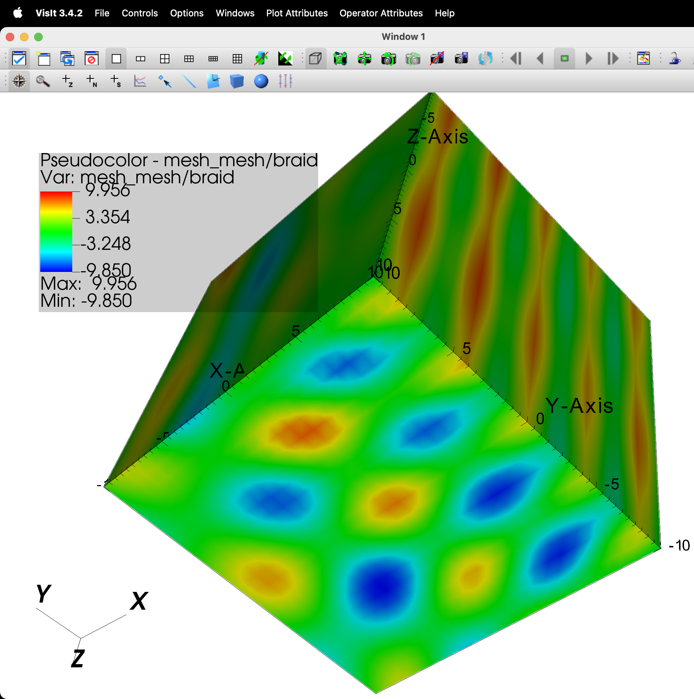
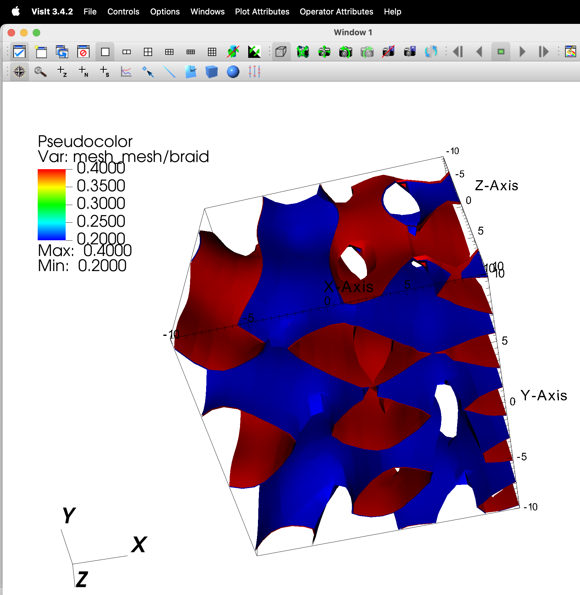
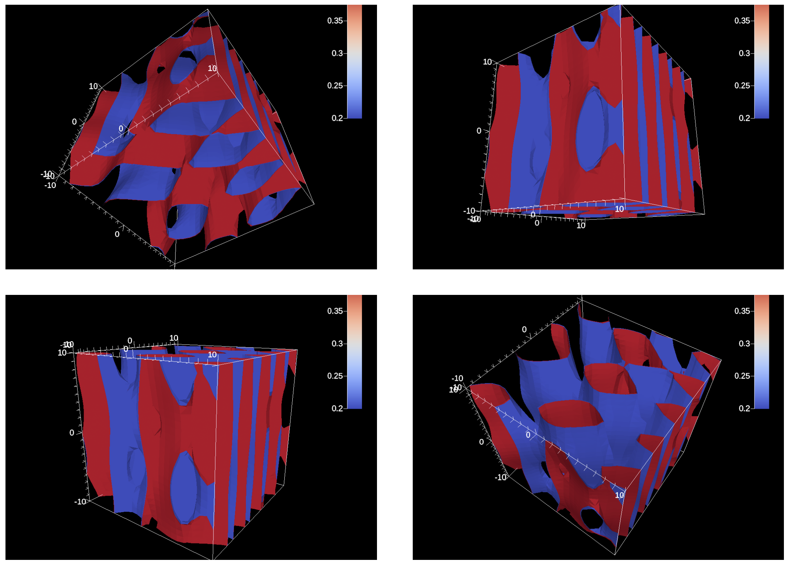

# Ascent extract Example

- https://ascent.readthedocs.io/en/latest/Tutorial_Intro_Extracts.html

## Capturing data with Extracts

Extracts are the construct that allows users to capture and process data
outside Ascent\'s pipeline infrastructure. Extract use cases include: Saving
mesh data to HDF5 files, creating Cinema databases, and running custom Python
analysis scripts. The following examples outline how to use several of Ascent
extracts.

### ascent_extract_example1.cpp

The [ascent_extract_example1.cpp][cpp1] example code is a minimal example of
exporting input mesh data to a Blueprint HDF5 file.

[cpp1]: https://github.com/Alpine-DAV/ascent/blob/develop/src/examples/tutorial/ascent_intro/cpp/ascent_extract_example1.cpp

```cpp
    Node mesh;
    conduit::blueprint::mesh::examples::braid("hexs", 25, 25, 25, mesh);
    // Creates a 3D mesh using Conduit Blueprint braid example
    // a 25×25×25 hex mesh stored in a conduit::Node named mesh

    Ascent a; // create an Ascent instance
    a.open(); // open ascent
    a.publish(mesh); // publish mesh data to ascent

    Node actions; // create a Conduit node of actions
    Node &add_act = actions.append();
    add_act["action"] = "add_extracts";

    // add a relay extract that will write mesh data to
    // blueprint hdf5 files
    Node &extracts = add_act["extracts"];
    extracts["e1/type"] = "relay";
    extracts["e1/params/path"] = "out_export_braid_all_fields";
    extracts["e1/params/protocol"] = "blueprint/mesh/hdf5";

    a.execute(actions); // execute the actions
    a.close(); // close ascent
```

#### ascent_actions.yaml

```yaml
-
  action: "add_extracts"
  extracts:
    e1:
      type: "relay"
      params:
        path: "out_export_braid_all_fields"
        protocol: "blueprint/mesh/hdf5"
```      

#### ascent_extract_example1.cpp -> .root -> [VisIt]

- ascent_extract_example1: out_export_braid_all_fields.cycle_000100.root



- ParaView: `LoadPlugin("/users/jfavre/Projects/InSitu/DummySPH/ParaView_scripts/pvReadBlueprintRootFile.py")`

[VisIt]: https://visit-dav.github.io/visit-website/releases-as-tables/

### Build and run on Alps

```sh
uenv image pull build::insitu_ascent/0.9.5:2109123735@daint
uenv start -v default insitu_ascent/0.9.5:2109123735

cp -a /user-tools/linux-neoverse_v2/ascent-0.9.5-*/examples/ascent/tutorial/ascent_intro/cpp .
cd cpp

make ASCENT_DIR=/user-tools/env/default/ ascent_extract_example1

L1=/user-tools/linux-neoverse_v2/cray-gtl-8.1.32-25u7zwci35lms4zyrodhf24vlfken7xo/lib

LD_LIBRARY_PATH=$L1:$LD_LIBRARY_PATH ./ascent_extract_example1
```

### ascent_extract_example2

The [ascent_extract_example2.cpp][cpp2] example code is a minimal example of
exporting selected fields from input mesh data to Blueprint HDF5 files.

[cpp2]: https://github.com/Alpine-DAV/ascent/blob/develop/src/examples/tutorial/ascent_intro/cpp/ascent_extract_example2.cpp

```cpp
    // add a relay extract that will write mesh data to
    // blueprint hdf5 files
    Node &extracts = add_act["extracts"];
    extracts["e1/type"] = "relay";
    extracts["e1/params/path"] = "out_export_braid_one_field";
    extracts["e1/params/protocol"] = "blueprint/mesh/hdf5";
    // add fields parameter to limit the export to only the "braid" field
    extracts["e1/params/fields"].append().set("braid");     // <---
```

```yaml
-
  action: "add_extracts"
  extracts:
    e1:
      type: "relay"
      params:
        path: "out_export_braid_one_field"
        protocol: "blueprint/mesh/hdf5"
        fields:
          - "braid"
```

### ascent_extract_example3

The [ascent_extract_example3.cpp][cpp3] example code is a minimal example of
exporting the result of a pipeline to Blueprint HDF5 files.

[cpp3]: https://github.com/Alpine-DAV/ascent/blob/develop/src/examples/tutorial/ascent_intro/cpp/ascent_extract_example3.cpp

```cpp
    // create a  pipeline (pl1) with a contour filter (f1)
    // and extract contours where braid variable equals 0.2 and 0.4
    pipelines["pl1/f1/type"] = "contour";
    Node &contour_params = pipelines["pl1/f1/params"];
    contour_params["field"] = "braid";
    double iso_vals[2] = {0.2, 0.4};     // <---
    contour_params["iso_values"].set(iso_vals,2);    

    // add a relay extract (e1) to export the pipeline result
    // (pl1) to blueprint hdf5 files
    extracts["e1/type"] = "relay";
    extracts["e1/pipeline"]  = "pl1";    // <---
    extracts["e1/params/path"] = "out_extract_braid_contour";
    extracts["e1/params/protocol"] = "blueprint/mesh/hdf5";
```

```yaml
-
  action: "add_pipelines"
  pipelines:
    pl1:
      f1:
        type: "contour"
        params:
          field: "braid"        
          iso_values: [0.2, 0.4]    // <---
-
  action: "add_extracts"
  extracts:
    e1:
      type: "relay"
      pipeline: "pl1"               // <---
      params:
        path: "out_extract_braid_contour"
        protocol: "blueprint/mesh/hdf5"
```

#### ascent_extract_example3.cpp -> .root -> [VisIt]

- ascent_extract_example3: out_extract_braid_contour.cycle_000100.root




### ascent_extract_example4

The [ascent_extract_example4.cpp][cpp4] example code is a minimal example of
creating a [Cinema] image database for post-hoc exploration.

[cpp4]: https://github.com/Alpine-DAV/ascent/blob/develop/src/examples/tutorial/ascent_intro/cpp/ascent_extract_example4.cpp
[Cinema]: https://ascent.readthedocs.io/en/latest/Actions/Scenes.html#actions-cinema

```cpp
    // declare a scene to render several angles of the pipeline result (pl1) to
    // a Cinema Image database
    Node &add_act2 = actions.append();
    add_act2["action"] = "add_scenes";
    Node &scenes = add_act2["scenes"];
    // add pseudocolor to scene
    scenes["s1/plots/p1/type"] = "pseudocolor";
    scenes["s1/plots/p1/pipeline"] = "pl1";
    scenes["s1/plots/p1/field"] = "braid";
    scenes["s1/renders/r1/type"] = "cinema"; // select cinema path
    scenes["s1/renders/r1/phi"] = 5;         // use 5 renders in phi
    scenes["s1/renders/r1/theta"] = 5;       // and 5 renders in theta
    // setup to output database to:
    //  cinema_databases/out_extract_cinema_contour
    scenes["s1/renders/r1/db_name"] = "out_extract_cinema_contour";
```

```yaml
-
  action: "add_pipelines"
  pipelines:
    pl1:
      f1:
        type: "contour"
        params:
          field: "braid"
          iso_values: [0.2, 0.4]
-
  action: "add_scenes"
  scenes:
    s1:
      plots:
        p1:
          type: "pseudocolor"
          pipeline: "pl1"
          field: "braid"
      renders:
        r1:
          type: "cinema"
          phi: 5
          theta: 5
          db_name: "out_extract_cinema_contour"
```

#### ascent_extract_example4.cpp -> [cinema_databases]

- ascent_extract_example4: 

```shell
cinema_databases/
└── out_extract_cinema_contour
    ├── 0.0
    │   ├── -108.0_0.0_out_extract_cinema_contour.png
    │   ├── 108.0_0.0_out_extract_cinema_contour.png
    │   ├── -108.0_108.0_out_extract_cinema_contour.png
    │   ├── 108.0_108.0_out_extract_cinema_contour.png
    │   ├── -108.0_144.0_out_extract_cinema_contour.png
    │   ├── 108.0_144.0_out_extract_cinema_contour.png
    │   ├── -108.0_36.0_out_extract_cinema_contour.png
    │   ├── 108.0_36.0_out_extract_cinema_contour.png
    │   ├── -108.0_72.0_out_extract_cinema_contour.png
    │   ├── 108.0_72.0_out_extract_cinema_contour.png
    │   ├── -180.0_0.0_out_extract_cinema_contour.png
    │   ├── -180.0_108.0_out_extract_cinema_contour.png
    │   ├── -180.0_144.0_out_extract_cinema_contour.png
    │   ├── -180.0_36.0_out_extract_cinema_contour.png
    │   ├── -180.0_72.0_out_extract_cinema_contour.png
    │   ├── -36.0_0.0_out_extract_cinema_contour.png
    │   ├── 36.0_0.0_out_extract_cinema_contour.png
    │   ├── -36.0_108.0_out_extract_cinema_contour.png
    │   ├── 36.0_108.0_out_extract_cinema_contour.png
    │   ├── -36.0_144.0_out_extract_cinema_contour.png
    │   ├── 36.0_144.0_out_extract_cinema_contour.png
    │   ├── -36.0_36.0_out_extract_cinema_contour.png
    │   ├── 36.0_36.0_out_extract_cinema_contour.png
    │   ├── -36.0_72.0_out_extract_cinema_contour.png
    │   └── 36.0_72.0_out_extract_cinema_contour.png
    ├── cvlib/...
    ├── data.csv
    ├── index.html
    ├── info.js
    └── info.json
```



- WIP: open "cinema_databases/out_extract_cinema_contour/index.html" with a webserver
