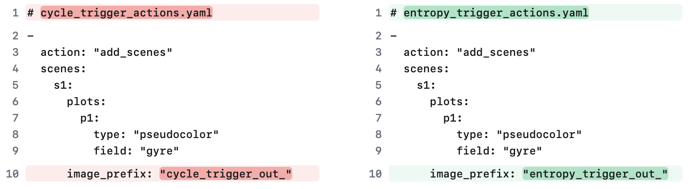
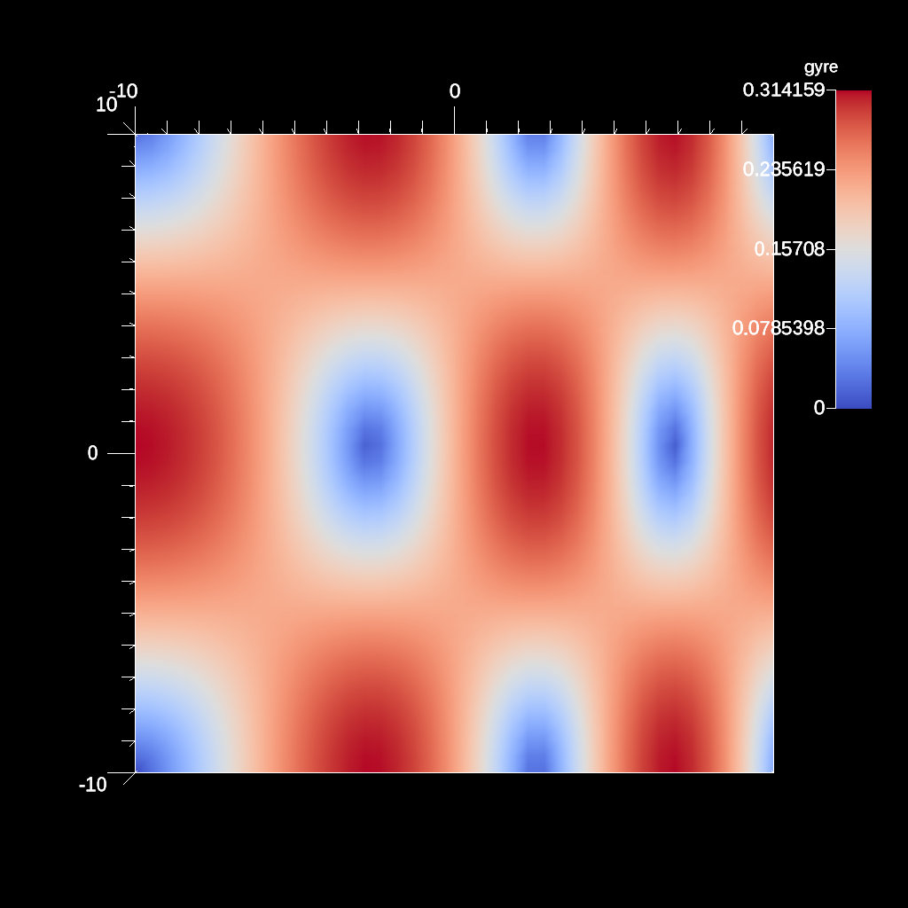
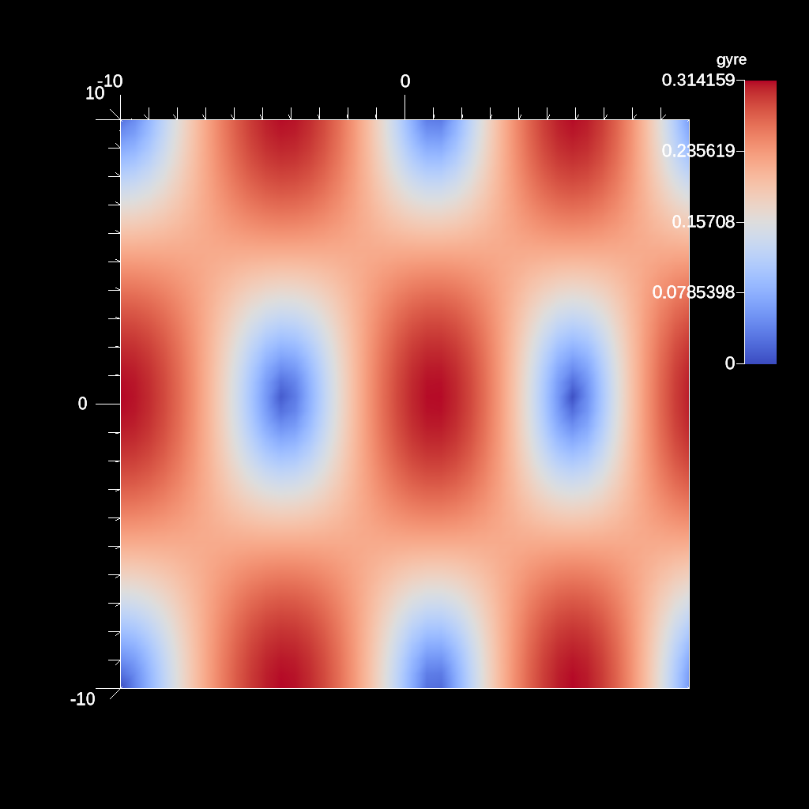

# Ascent trigger Example

- https://ascent.readthedocs.io/en/latest/Tutorial_Intro_Triggers.html

## Adapting visualization with Triggers

Triggers allow the user to specify a set of actions that are triggered by the
result of a boolean expression. They provide flexibility to adapt what analysis
and visualization actions are taken in situ. Triggers leverage Ascent\'s Query
and Expression infrastructure.

### ascent_trigger_example1.cpp

The [ascent_trigger_example1.cpp][cpp1] example code is a minimal example of
using triggers to render when events occur.

[cpp1]: https://github.com/Alpine-DAV/ascent/blob/develop/src/examples/tutorial/ascent_intro/cpp/ascent_trigger_example1.cpp
[cycle_trigger_actions.yaml]: https://github.com/Alpine-DAV/ascent/blob/develop/src/examples/tutorial/ascent_intro/notebooks/cycle_trigger_actions.yaml
[entropy_trigger_actions.yaml]: https://github.com/Alpine-DAV/ascent/blob/develop/src/examples/tutorial/ascent_intro/notebooks/entropy_trigger_actions.yaml

```cpp
    // [...]
    // add a first trigger (t1) that fires at cycle 500
    triggers["t1/params/condition"] = "cycle() == 500";
    triggers["t1/params/actions_file"] = "cycle_trigger_actions.yaml";

    // add a second trigger (t2) that fires when the change in entropy exceeds
    // 0.5 the history function allows you to access query results of previous
    // cycles, relative_index indicates how far back in history to look.
    // we expect to see a jump // in entropy at cycle 200, so we expect the
    // trigger to fire at cycle 200
    triggers["t2/params/condition"] = "entropy - history(entropy, relative_index = 1) > 0.5";
    triggers["t2/params/actions_file"] = "entropy_trigger_actions.yaml";
    // [...]
    for( int step =0; step < nsteps; step++) {
        tutorial_gyre_example(time_value, mesh); // generate a gyre mesh varying with time
        mesh["state/cycle"] = 100 + step * 100;
        mesh["state/cycle"] = cycle;
        std::cout << "time: " << time_value << " cycle: " << cycle << std::endl; 
        a.publish(mesh); // publish mesh to ascent
        a.execute(actions);
        time_value = time_value + delta_time; // update time
    }
    a.execute(actions); // execute the actions
    a.close(); // close ascent
    // view the results of the triggers executed
    std::cout << info["expressions"].to_yaml() << std::endl;
```

using the following 2 actions file:



#### ascent_actions.yaml

```yaml
-
  action: "add_queries"
  queries:
    q1:
      params:
        expression: "entropy(histogram(field('gyre'), num_bins=128))"
        name: "entropy"
-
  action: "add_triggers"
  triggers:
    t1:
      params:
        condition: "cycle() == 500"
        actions_file: "cycle_trigger_actions.yaml" # <---
    t2:
      params:
        condition: "entropy - history(entropy, relative_index = 1) > 0.5"
        actions_file: "entropy_trigger_actions.yaml" # <---
```

#### ascent_trigger_example1.cpp -> .png + query results

- cycle_trigger_out_000500.png


- entropy_trigger_out_000200.png


### Build and run on Alps

```sh
uenv image pull build::insitu_ascent/0.9.5:2109123735@daint
uenv start -v default insitu_ascent/0.9.5:2109123735

cp -a /user-tools/linux-neoverse_v2/ascent-0.9.5-*/examples/ascent/tutorial/ascent_intro/cpp .
cd cpp
cp /user-tools/linux-neoverse_v2/ascent-0.9.5-*/examples/ascent/tutorial/ascent_intro/notebooks/entropy_trigger_actions.yaml .
cp /user-tools/linux-neoverse_v2/ascent-0.9.5-*/examples/ascent/tutorial/ascent_intro/notebooks/cycle_trigger_actions.yaml .

make ASCENT_DIR=/user-tools/env/default/ ascent_trigger_example1

L1=/user-tools/linux-neoverse_v2/cray-gtl-8.1.32-25u7zwci35lms4zyrodhf24vlfken7xo/lib

LD_LIBRARY_PATH=$L1:$LD_LIBRARY_PATH ./ascent_trigger_example1
```

