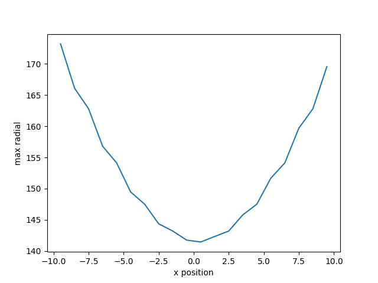
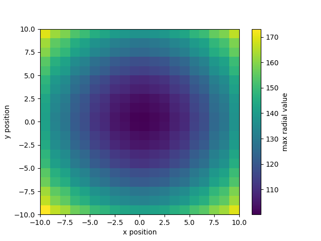
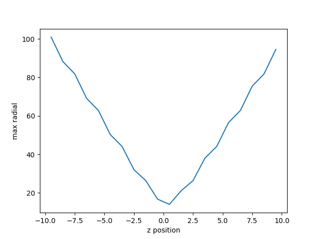

# Ascent binning Example

- https://ascent.readthedocs.io/en/latest/Tutorial_Intro_Binning.html
    - [C++ example](###ascent_binning_example1.cpp)
    - [Yaml actions](###ascent_actions.yaml)
    - [Outputs](####Outputs)
    - [Alps](###Build-and-run-on-Alps)

## Data Binning

Ascent provides a multi-dimensional data binning capability that allows you to
calculate spatial distributions, find extreme values, etc. With the right
approach, you can implement mesh agnostic analysis that can be used across
simulation codes. You can also map the binned result back onto the original
mesh topology to enable further analysis, like deviations from an average.
These examples show how to define and execute binning operations using Ascent’s
query interface.

### ascent_binning_example1.cpp

The [ascent_binning_example1.cpp][cpp1] example code is a minimal example of
binning (1D, 2D or 3D) data spatially

[cpp1]: https://github.com/Alpine-DAV/ascent/blob/develop/src/examples/tutorial/ascent_intro/cpp/ascent_binning_example1.cpp

```cpp
    // [...]
    a.publish(mesh); // publish mesh to ascent
    Node &queries = add_act["queries"] ;

    // Create a 1D binning projected onto the x-axis
    queries["q1/params/expression"] = "binning('radial','max', [axis('x',num_bins=20)])";
    queries["q1/params/name"] = "1d_binning";

    // Create a 2D binning projected onto the x-y plane
    queries["q2/params/expression"] = "binning('radial','max', [axis('x',num_bins=20), axis('y',num_bins=20)])";
    queries["q2/params/name"] = "2d_binning";

    // Create a binning that emulates a line-out, that is, bin all values
    // between x = [-1,1], y = [-1,1] along the z-axis in 20 bins.
    // The result is a 1x1x20 array
    queries["q3/params/expression"] = "binning('radial','max', [axis('x',[-1,1]), axis('y', [-1,1]), axis('z', num_bins=20)])";
    queries["q3/params/name"] = "3d_binning";
    // run the python scripts to plot the binning results (see below)

    // You can also examine the results by looking at result of the expressions
    std::cout << info["expressions"].to_yaml() << std::endl;
    // same data is stored in ascent_session.yaml
```

#### ascent_actions.yaml

```yaml
-
  action: "add_queries"
  queries:
    q1:
      params:
        expression: "binning('radial','max', [axis('x',num_bins=20)])"
        name: "1d_binning"
    q2:
      params:
        expression: "binning('radial','max', [axis('x',num_bins=20), axis('y',num_bins=20)])"
        name: "2d_binning"
    q3:
      params:
        expression: "binning('radial','max', [axis('x',[-1,1]), axis('y', [-1,1]), axis('z', num_bins=20)])"
        name: "3d_binning"
```

#### Outputs

- ascent_trigger_example1.cpp -> 1D_binning.png:



- ascent_trigger_example1.cpp -> 2D_binning.png:



- ascent_trigger_example1.cpp -> 3D_binning.png:



### Build and run on Alps

```sh
uenv image pull build::insitu_ascent/0.9.5:2109123735@daint
uenv start -v default insitu_ascent/0.9.5:2109123735

cp -a /user-tools/linux-neoverse_v2/ascent-0.9.5-*/examples/ascent/tutorial/ascent_intro/cpp .
cd cpp

make ASCENT_DIR=/user-tools/env/default/ ascent_binning_example1

L1=/user-tools/linux-neoverse_v2/cray-gtl-8.1.32-25u7zwci35lms4zyrodhf24vlfken7xo/lib

LD_LIBRARY_PATH=$L1:$LD_LIBRARY_PATH ./ascent_binning_example1

sed -i "s@yaml.load@yaml.safe_load@" plot_binning_1d.py
sed -i "s@yaml.load@yaml.safe_load@" plot_binning_2d.py
sed -i "s@yaml.load@yaml.safe_load@" plot_binning_3d.py

python3 plot_binning_1d.py  # will plot data from ascent_session.yaml (1D)
python3 plot_binning_2d.py  # will plot data from ascent_session.yaml (2D)
python3 plot_binning_3d.py  # will plot data from ascent_session.yaml (3D)
```

