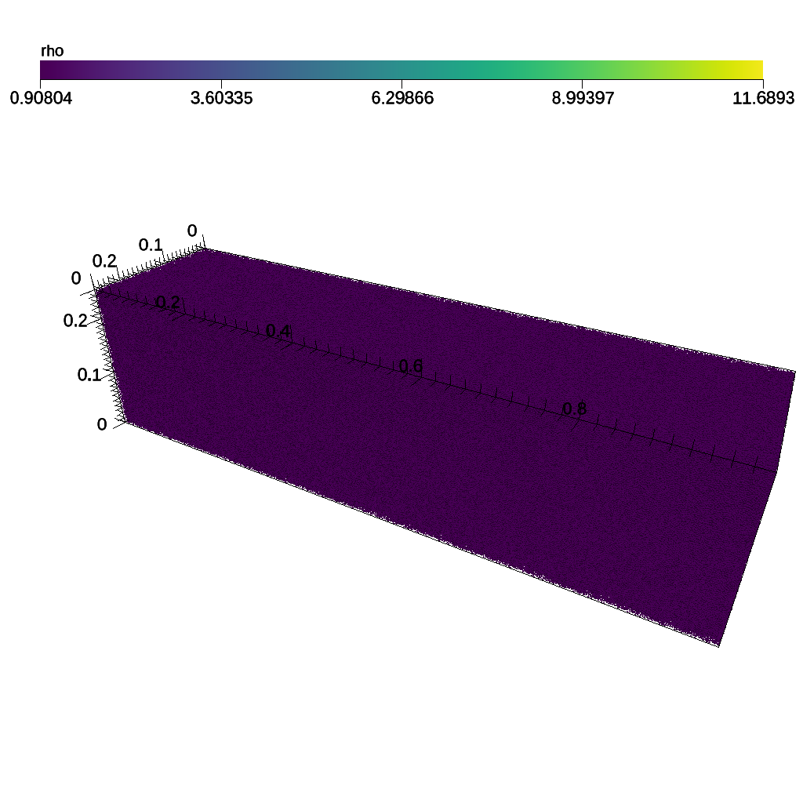
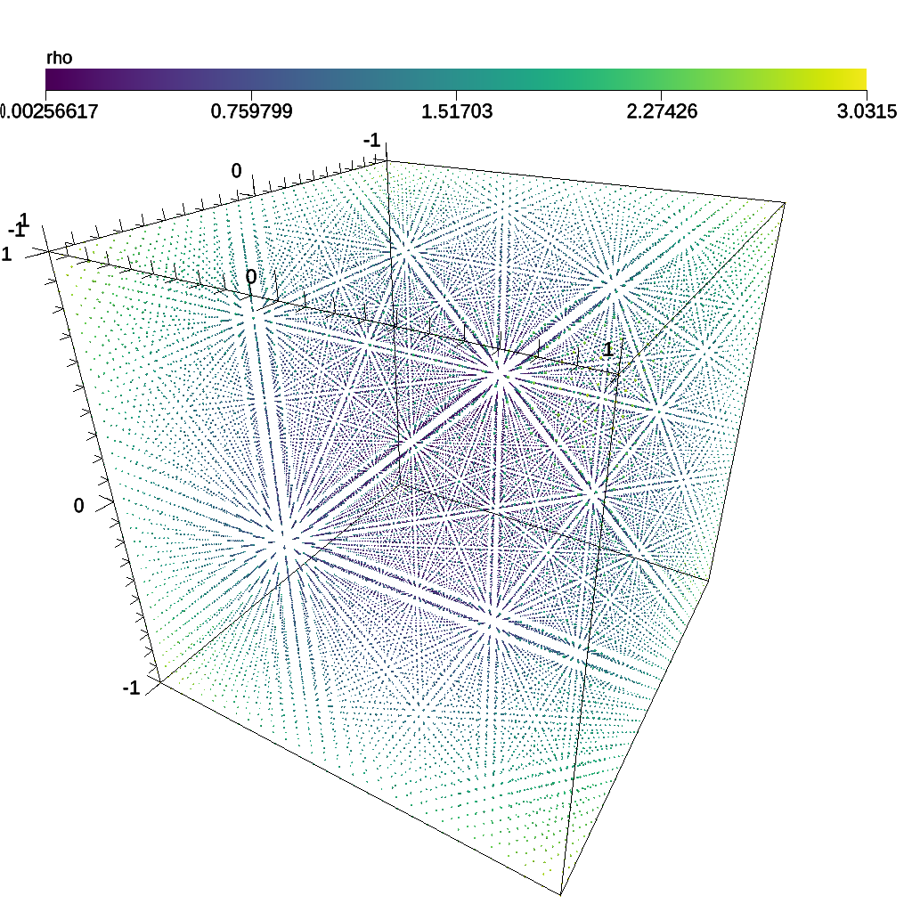

# DummySPH

- https://github.com/jfavre/DummySPH.git

[DummySPH] is a mini-app to test in situ visualization libraries for Smoothed
Particle Hydrodynamics. DummySPH supports a set of tests:

- rendering or thresholding or compositing or binning or histsampling or occa

runtime options:

- aos = ON or OFF # ON = AOS (tipsy data), OFF = SOA (std::vector data)
- fp64 = ON or OFF # OFF=<float>, ON=<double>
- tipsy = ON or OFF
- h5part = ON or OFF

and input files:

- hr8799_bol_bd1.017300 # tipsy input file
- dump_wind-shock.h5 # sphexa input file

[DummySPH]: https://github.com/jfavre/DummySPH.git

## Build and run on Alps

### RENDERING

```sh
# setup the environment:
uenv image pull build::insitu_ascent/0.9.5:2109123735@daint
uenv start -v default insitu_ascent/0.9.5:2109123735

# get the code:
git clone https://github.com/jfavre/DummySPH.git DummySPH.git
cd DummySPH.git ; git checkout dededc1 ; git switch -c dededc1 ; cd ..

# build with:
cmake \
    -DCMAKE_BUILD_TYPE=Debug \
    -DCMAKE_CUDA_HOST_COMPILER=mpicxx \ 
    -DSTRIDED_SCALARS=OFF \
    -DSPH_DOUBLE=ON \
    -DCAN_LOAD_TIPSY=OFF \
    -DCAN_LOAD_H5Part=ON \
    -DINSITU=Ascent \
    -DAscent_DIR=$(find /user-tools/ -name ascent | grep ascent- | grep cmake) \
    -DCMAKE_CUDA_ARCHITECTURES=90 \
    -S DummySPH.git/src -B build
    # -DSPH_DOUBLE=OFF also works

cmake --build build -j # -v

# run with:
srun -n 1 -t5 ./build/bin/dummysph_ascent --rendering out
# or
srun -n 1 -t5 ./build/bin/dummysph_ascent --rendering out \
    --h5part /capstor/store/cscs/cscs/public/reframe/resources/ascent/inputs/dump_wind-shock.h5
```

#### Outputs

A successful job will generate the following output files:

- simple_trigger_actions.yaml:

```yaml
-
  action: "add_scenes"
  scenes:
    s1:
      plots:
        p1:
          type: "pseudocolor"
          field: "rho"
          color_table:
            name: "viridis"
      renders:
        r1:
          color_bar_position: [-0.9, 0.9, 0.8, 0.85]
          camera:
            azimuth: 30.0
            elevation: 30.0
          image_prefix: "datasets/out_%04d"
          bg_color: [1.0, 1.0, 1.0]
          fg_color: [0.0, 0.0, 0.0]
```

and:

- datasets/out_0000.png (with    --h5part): 

- datasets/out_0001.png (without --h5part): 
