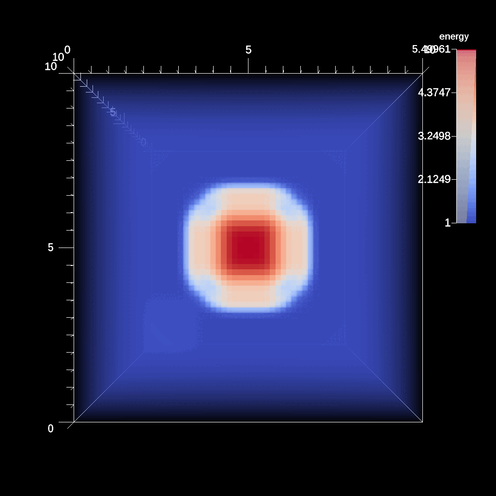

# CloverLeaf3D

- https://ascent.readthedocs.io/en/latest/ExampleIntegrations.html#cloverleaf3d

CloverLeaf3D is a proxy-application written in Fortran90, parallelized with
MPI+OpenMP ([OpenACC] and [OpenCL] implementations are also available).

- The version of the code instrumented with Ascent can be found in src/examples/proxies/cloverleaf3d-ref/:
    - Data integration (Conduit): [src/examples/proxies/cloverleaf3d-ref/visit.F90],
    - Ascent API: [src/examples/proxies/cloverleaf3d-ref/hydro.f90],
    - Notice that the code in clover.F90 and clover_main.cpp differ from the code in [CloverLeaf3D].

[CloverLeaf3D]: https://github.com/UK-MAC/CloverLeaf3D_ref.git
[OpenACC]: https://github.com/UK-MAC/CloverLeaf_OpenACC_3D
[OpenCL]: https://github.com/UK-MAC/CloverLeaf3D_OpenCL
[src/examples/proxies/cloverleaf3d-ref/visit.F90]: https://github.com/Alpine-DAV/ascent/blob/develop/src/examples/proxies/cloverleaf3d-ref/visit.F90#L159
[src/examples/proxies/cloverleaf3d-ref/hydro.f90]: https://github.com/Alpine-DAV/ascent/blob/develop/src/examples/proxies/cloverleaf3d-ref/hydro.f90#L49

## Build and run on Alps

### Setup

- First, get the Ascent version of the source code

```sh
git clone --no-checkout --depth=1 https://github.com/Alpine-DAV/ascent.git ascent.git
cd ascent.git
git config core.sparseCheckout true
echo src/examples/proxies/cloverleaf3d-ref > .git/info/sparse-checkout
git checkout develop
cd ..
cp ./Makefile ascent.git/src/examples/proxies/cloverleaf3d-ref/Makefile # !
```

### Build and Run 

#### Inputs

- CloverLeaf3D uses:
    - `clover.in` as input deck to describe the problem setup and trigger Ascent (`grep visit_frequency clover.in`),
    - `ascent_actions.json` to define a sequence of operations to be executed,
    - `ascent_options.json` to configure behavior and runtime settings.

In this example, `we use ascent_actions_contour_tree_energy.json`:

```
cat ascent_options.json 
cp ascent_actions_contour_tree_energy.json ascent_actions.json
```

#### Build

- Build the code with:

```sh
uenv image pull build::insitu_ascent/0.9.5:2109123735@daint
uenv start -v default insitu_ascent/0.9.5:2109123735
cd src/examples/proxies/cloverleaf3d-ref/
make ASCENT_DIR=/user-tools/env/default/ 
```

- Run the code with:

```
# uenv start -v default insitu_ascent/0.9.5:2109123735
# cd src/examples/proxies/cloverleaf3d-ref/
OMP_NUM_THREADS=16 srun -n4 -t5 ./cloverleaf3d.exe
```

#### Outputs

- A successful job will generate the following output files:

```
# step: 200
# Calculation complete
    contour_tree_0[010-200].png
    levels_0[010-200].png
    s1_0_000[010-200].png
```

- s1_0_000[010-200].png: 
