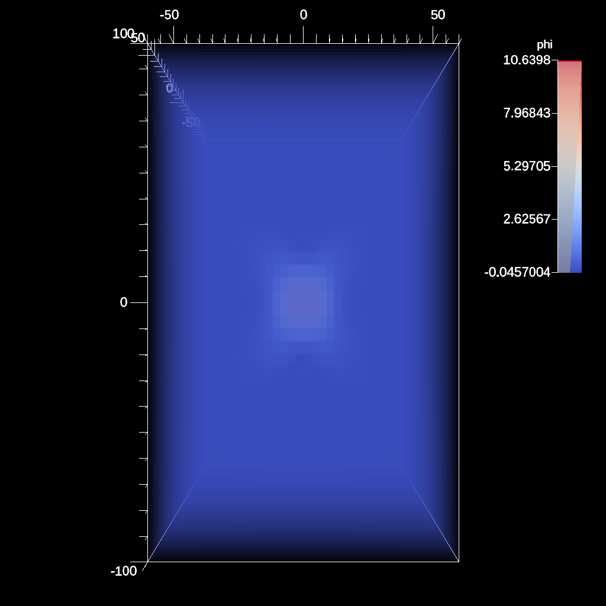

# Kripke

- https://ascent.readthedocs.io/en/latest/ExampleIntegrations.html#kripke

[Kripke] is a scalable deterministic neutron transport solver that has an
embedded test problem. Unlike the other proxy-applications, Kripke does not
have discrete time steps. Instead, the simulation represents a single moment in
time and the iterations converge to a solution for the problem.

- The version of the code instrumented with Ascent can be found in
[Sweep_Solver.cpp] at lines 47 and 104.

```
Kripke is meant to study the efficiency of different loop orderings and memory
layouts for different architectures which makes zero copying the data
difficult. Thus, the data is extracted each iteration.
```

[Kripke]: https://github.com/LLNL/Kripke.git
[Sweep_Solver.cpp]: https://github.com/Alpine-DAV/ascent/blob/develop/src/examples/proxies/kripke/Kripke/Sweep_Solver.cpp#L47

## Build and run on Alps

```sh
# Get the Ascent version of the Kripke source code:
git clone --no-checkout --depth=1 https://github.com/Alpine-DAV/ascent.git ascent.git
cd ascent.git
git config core.sparseCheckout true
echo src/examples/proxies/kripke > .git/info/sparse-checkout
git checkout develop
cd ..
cp ./CMakeLists.txt ascent.git/src/examples/proxies/kripke/CMakeLists.txt # !


# Build the code with:
uenv image pull build::insitu_ascent/0.9.5:2109123735@daint
uenv start -v default insitu_ascent/0.9.5:2109123735@daint

ccmake -S ascent.git/src/examples/proxies/kripke/ -B build \
-DCMAKE_CXX_COMPILER=mpicxx \
-DCMAKE_BUILD_TYPE=Debug

cmake --build build -t Kripke -j # -v
# or use the precompiled code:
# /user-tools/linux-neoverse_v2/ascent-0.9.5*/examples/ascent/proxies/kripke/kripke_par

# Run the code with:
ln -s ./ascent.git/src/examples/proxies/kripke/ascent_options.json .
ln -s ./ascent.git/src/examples/proxies/kripke/ascent_actions.json .
ln -s ./ascent.git/src/examples/proxies/kripke/run_kripke_simple_example.sh .

OMP_NUM_THREADS=16 \
    srun -n 8 -t10 -A `id -gn` -u \
    ./build/Kripke \
    --procs 2,2,2 --zones 32,32,32 --niter 10 --dir 1:2 --grp 1:1 --legendre 4 \
    --quad 4:4
```

#### Outputs

- A successful job will generate the following output files:

```
# iter 9: particle count=2.708873e+06, change=0.000000e+00
# blueprint verify succeeded
s1_0_000[00-10].png
```

- s1_0_000099.png.png: 
