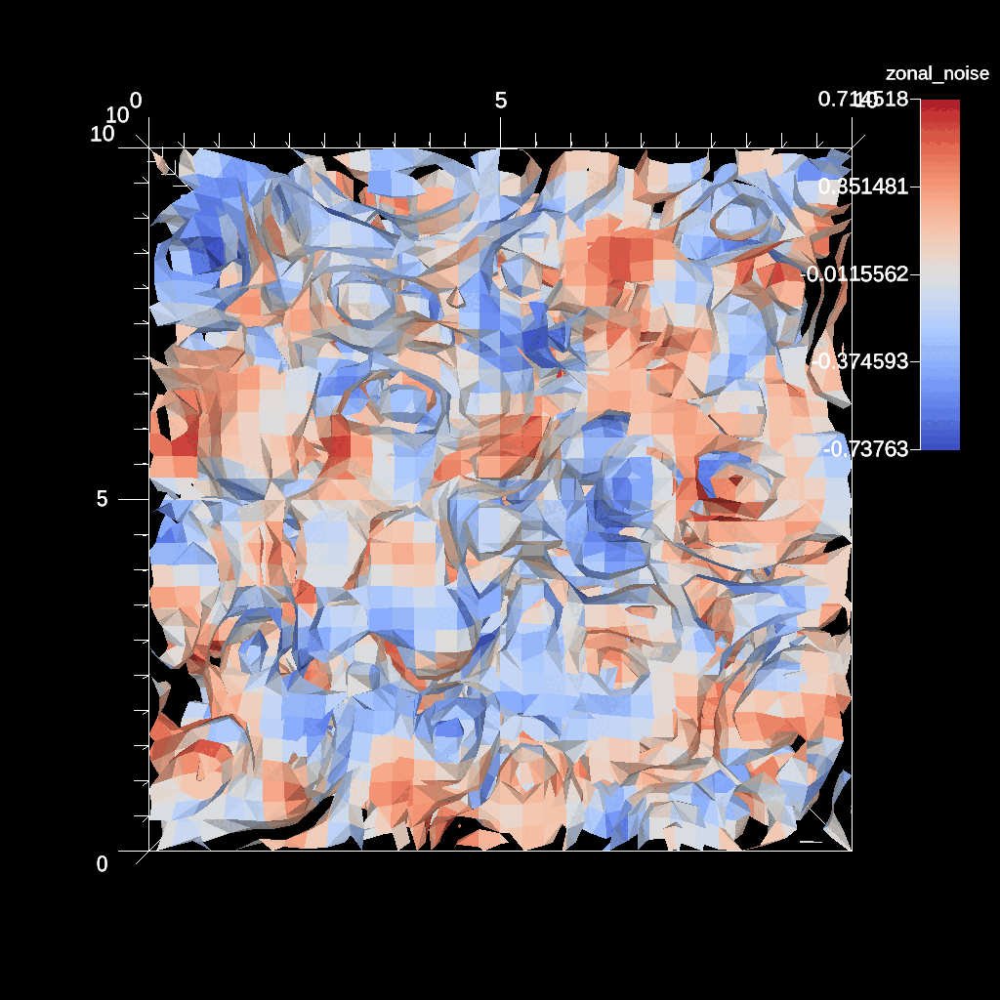

# Noise

- https://ascent.readthedocs.io/en/latest/ExampleIntegrations.html#noise

The noise application generates a synthetic data set based on the open
[simplex-noise] n-dimensional smooth noise function. A version of the code
instrumented with Ascent can be found in [noise.cpp].

[simplex-noise]: https://github.com/smcameron/open-simplex-noise-in-c.git
[noise.cpp]: https://github.com/Alpine-DAV/ascent/blob/develop/src/examples/synthetic/noise/noise.cpp#L398

## Build and run on Alps

```sh
# Get the Ascent version of the noise source code:
git clone --no-checkout --depth=1 https://github.com/Alpine-DAV/ascent.git ascent.git
cd ascent.git
git config core.sparseCheckout true
echo src/examples/synthetic/noise > .git/info/sparse-checkout
git checkout develop
cd ..
cp ./CMakeLists.txt ascent.git/src/examples/synthetic/noise/CMakeLists.txt # !


# Build the code with:
uenv image pull build::insitu_ascent/0.9.5:2109123735@daint
uenv start -v default insitu_ascent/0.9.5:2109123735@daint

cmake -S ascent.git/src/examples/synthetic/noise \
-B build \
-DCMAKE_CXX_COMPILER=mpicxx \
-DCMAKE_BUILD_TYPE=Debug

cmake --build build -t noise -j # -v
# or use the precompiled code:
# /user-tools/linux-neoverse_v2/ascent-0.9.5*/examples/ascent/synthetic/noise/noise_par

# Run the code with:
cp ascent.git/src/examples/synthetic/noise/example_actions.yaml ascent_actions.yaml

OMP_NUM_THREADS=16 \
    srun -n 8 -t2 -A `id -gn` -u \
    ./build/noise \
    --dims=32,32,32 --time_steps=5 --time_delta=.5
```

where `ascent_actions.yaml` is:

```yaml
-
  action: "add_pipelines"
  pipelines:
    p1:
      f1:
        type: "contour"
        params:
          field: "nodal_noise"
          levels: 5
-
  action: "add_scenes"
  scenes:
    s1:
      plots:
        p1:
          type: "pseudocolor"
          field: "zonal_noise"
          pipeline: "p1"
```

#### Outputs

- A successful job will generate .png files: 
