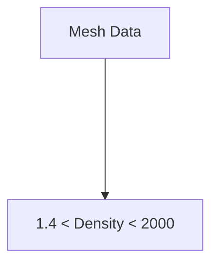
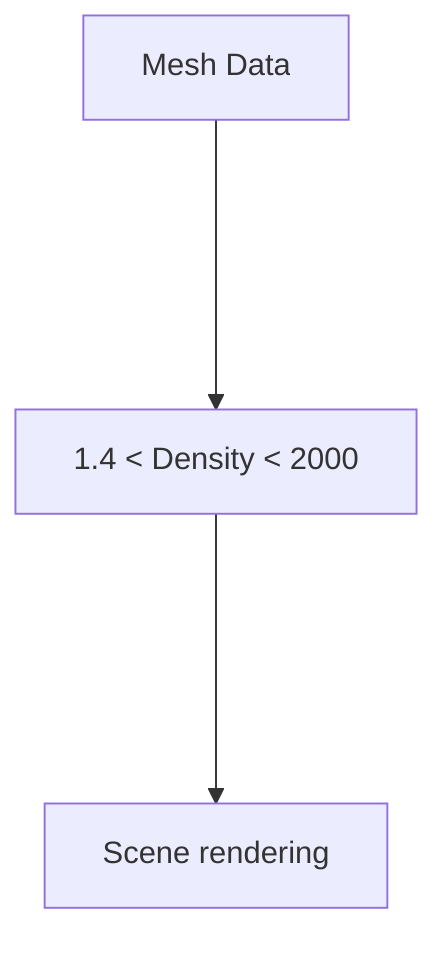

# Ascent: an _in situ_ visualization and analysis library<br>based on _Conduit_

---
level: 2
---

# Ascent

[Ascent] is an easy-to-use flyweight in situ visualization and analysis library for HPC simulations:

- Supports: Making Pictures, Transforming Data, and Capturing Data for use outside of Ascent
- Young effort, yet already includes most common visualization operations
- Provides a simple infrastructure to integrate custom analysis
- Provides C++, C, Python, and Fortran APIs

- References:
    - [Ascent: A Flyweight In Situ Library for Exascale Simulations], M. Larsen et al., 2022
    - [The ALPINE in situ infrastructure: Ascending from the ashes of strawman], M. Larsen et al.

[Ascent]: https://ascent.readthedocs.io/en/latest/index.html
[Ascent: A Flyweight In Situ Library for Exascale Simulations]: https://link.springer.com/chapter/10.1007/978-3-030-81627-8_12
[The ALPINE in situ infrastructure: Ascending from the ashes of strawman]: https://dl.acm.org/doi/10.1145/3144769.3144778

---
level: 2
---

# Ascent

Ascent is based on several components:

- The Conduit Mesh Blueprint
- Runtimes providing analysis, rendering and I/O
    - Runtimes will execute a number of `actions`, defined by Conduit Nodes
- Data Adaptors (internal)

<div class="w-99 ml-60">
      
</div>

---
level: 2
---

# Scene description (JSON or YAML format)

<div grid="~ cols-2 gap-4" class="mt-4">

 <div class="col-span-1">
```json
// JSON

"action": "add_scenes",
    "scenes": {
        "s1": {
            "plots": {
                "p1": {"type": "pseudocolor",
                       "field": "Density"}
                },
                "renders": {
                    "r1": {
                        "image_prefix": "density.%05d",
                        "camera": {
                            "look_at": [0, 0, 0],
                            "position": [-2.17,1.79,1.80],
                            "up": [0.44, 0.84, -0.30]
                        }
                    }
                }
            }
        }
```
 </div>

 <div class="col-span-1">
```yaml
# YAML

- 
 action: "add_scenes"
 scenes:
   s1:
     plots:
       p1:
         type: "pseudocolor"
         field: "Density"
     renders:
       r1:
         image_prefix: "density_%05d"
         camera:
           azimuth: 30.0
           elevation: 30.0
```

- C++ examples:
    - [01_first_light_rendering](https://github.com/jfavre/InSitu-Vis-Tutorial/blob/main/AscentIntro/cpp/01_first_light_rendering.md)
    - [04_scene](https://github.com/jfavre/InSitu-Vis-Tutorial/blob/main/AscentIntro/cpp/04_ascent_scene.md)

 </div>
</div>

---
level: 2
---

# A pipeline "pl1" description

<div grid="~ cols-2 gap-4" class="mt-4">

 <div class="col-span-1">
```json
// JSON

"action": "add_pipelines",
    "pipelines": {
        "pl1": {
            "f1": {
                "type": "threshold",
                "params": {
                    "field": "Density",
                    "min_value": 1.4,
                    "max_value": 2000
                }
            }
        }
    },
```
 </div>

 <div class="col-span-1">

 </div>
</div>

---
level: 2
---

# The new pipeline refines the scene description

<div grid="~ cols-2 gap-4" class="mt-4">

 <div class="col-span-1">
```json
// JSON

"action": "add_pipelines",
    "pipelines": {
        "pl1": {                       
            "f1": {                    
                "type": "threshold",    
                "params": {
                    "field": "Density",
                    "min_value": 1.4,
                    "max_value": 2000
                    // ...
 
"action": "add_scenes",
    "scenes": {
        "s1": {
            "plots": {
                "p1": {"type": "pseudocolor",
                       "pipeline": "pl1",
                       "field": "Density"
                   }
               }
           }
       },
```
 </div>

 <div class="col-span-1">


- C++ example: [05_pipeline](https://github.com/jfavre/InSitu-Vis-Tutorial/blob/main/AscentIntro/cpp/05_ascent_pipeline.md)

 </div>
</div>

